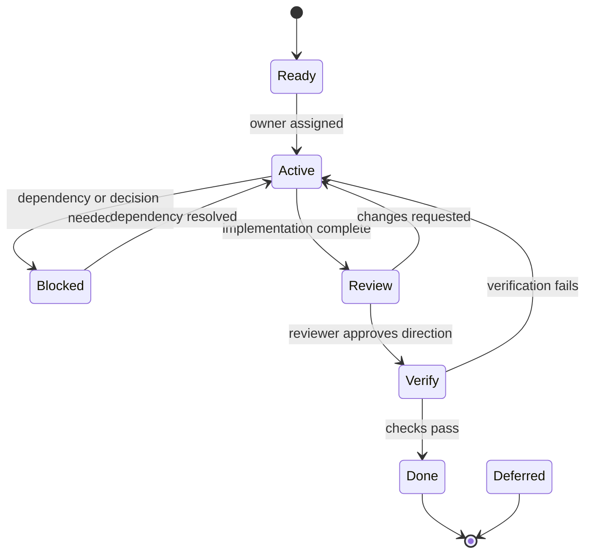

# Custody-First Orchestration

Custody-First Orchestration is a multi-agent maintenance pattern for codebases that need parallel work without losing control of scope, verification, or auditability.

The core idea is simple:

**Every delegated task has one owner, one bounded scope, one verification plan, and one explicit handoff.**

That is what makes the work safe to parallelize. Not the number of agents. Not the size of the model. The custody rules.

## Why This Pattern Exists

Common multi-agent setups are good at decomposition, but weak at custody.

- Manager/worker systems can split work, but often blur ownership once tasks start touching the same files.
- Handoff systems can transfer context, but the transfer is often informal and not machine-checkable.
- Graph-based orchestrators can express dependencies, but do not automatically prevent scope overlap or undocumented completion.

Custody-First Orchestration keeps the useful parts of those patterns and adds the missing controls:

- explicit ownership
- disjoint file or concern boundaries
- verification before merge
- durable audit records
- public-friendly task tracking

That makes the pattern well suited to software maintenance, release work, security-sensitive changes, and repository operations that must remain legible to humans.

## Definition

In Custody-First Orchestration:

1. A lead agent or human defines a task packet.
2. The packet assigns a single accountable owner.
3. The packet names the exact scope of custody.
4. The packet records acceptance criteria and verification steps before work begins.
5. The owner completes the packet without crossing into unrelated scope.
6. A reviewer or verifier checks the result.
7. The handoff is recorded with evidence.

If any of those steps are missing, the work is not complete enough to trust.

## The Invariants

These are the rules that make the pattern useful.

1. **Single owner per packet**
   Every active packet has exactly one accountable owner.

2. **Bounded scope**
   The packet scope is described in concrete paths, modules, or named concerns. “Improve security” is not a scope.

3. **Disjoint active work**
   Two active packets do not edit the same file set unless the work is explicitly serialized.

4. **Verification is planned up front**
   The packet states what will be tested or reviewed before the implementation starts.

5. **Done means verified**
   A packet cannot be marked done without a recorded check, test, or manual review.

6. **Handoffs are explicit**
   Completion includes a short report: what changed, what was verified, and what remains risky.

7. **Secrets stay out of packets**
   No token, private Slack content, customer data, or raw credentials belong in a work packet or handoff.

8. **Review is separate when risk is real**
   A reviewer can be the same person as the owner for trivial work, but higher-risk work should get a distinct review pass.

9. **The public record matches the actual work**
   If a change affects release behavior, security posture, or user-visible workflows, the docs and task ledger should say so.

## Roles

Custody-First Orchestration uses a small set of roles. One person or agent may hold more than one role over time, but not at the same moment for the same packet.

| Role | Responsibility |
| --- | --- |
| Lead | Defines scope, assigns custody, decides sequence, and integrates completed work. |
| Worker | Implements one bounded packet inside the assigned scope. |
| Explorer | Answers a narrow question or maps the codebase without changing it. |
| Reviewer | Looks for bugs, security issues, missing tests, and spec drift. |
| Verifier | Runs tests, checks screenshots, or performs manual QA on a finished packet. |
| Release lead | Confirms the final checkpoint, release hygiene, and public-facing docs before tagging or shipping. |

The lead is not a permanent manager. The role belongs to the turn. The point is custody, not hierarchy.

## State Machine

The packet lifecycle should be visible and boring.



Recommended states:

- `Ready`: the packet is specific enough to start.
- `Active`: a named owner is working it.
- `Blocked`: the work needs a decision or dependency.
- `Review`: implementation is complete and needs inspection.
- `Verify`: review passed and checks are running.
- `Done`: merged or committed with verification recorded.
- `Deferred`: intentionally not part of the current release.

## Packet Shape

A good packet is short, specific, and auditable.

```yaml
id: CFO-0011
title: Harden orchestrator authorization
status: active
owner: subagent-worker
role: worker
priority: p0
objective: Enforce repo and channel authorization in the orchestrator.
paths:
  - apps/orchestrator/src/tasks.ts
  - packages/shared/src/authorization.ts
concerns:
  - concern:authorization-policy
dependencies:
  - CFO-0002
non_goals:
  - Do not change unrelated Slack listeners.
  - Do not alter release tagging.
acceptance:
  - Authorization is fail-closed.
  - Repo-scoped rules are enforced centrally.
  - Tests cover allow and deny paths.
verification:
  required:
    - npm test
    - npm run check
  completed: []
  evidence: []
risks:
  - Policy defaults can accidentally deny valid users if config is incomplete.
handoff:
  expected:
    - Reviewer validates policy precedence and docs coverage.
  completed: []
  next: []
```

The packet should make a stranger able to understand the work without reading the full chat history.

## What Makes It Better Than Common Patterns

Custody-First Orchestration improves on the usual manager/worker or handoff patterns in a few specific ways.

### Compared with manager/worker

Manager/worker systems usually focus on decomposition. They answer “who does what?” but not always “who owns the boundary?”

Custody-First Orchestration adds:

- path-level ownership
- explicit non-goals
- verification as part of the packet
- a completion standard tied to evidence

That matters because most bugs in agent-assisted maintenance come from boundary drift, not from the initial decomposition.

### Compared with handoff systems

Handoff systems are useful when work moves from one agent to another, but the transfer can become a blob of free-form context.

Custody-First Orchestration requires:

- a named owner
- a concrete state
- a verification step
- a recorded next action

That keeps the handoff concrete enough for review.

### Compared with workflow graphs

Workflow graphs are good at orchestration, but they can hide accountability inside edges and nodes.

Custody-First Orchestration keeps the graph, but makes the packet the unit of truth.

The packet says:

- what this work is
- who owns it
- what it may touch
- how it will be checked
- how the next owner should read the result

## Anti-Patterns

Avoid these. They create the illusion of progress while weakening custody.

- `Improve security` with no exact files, no scope, and no verification.
- Two active packets touching the same listener, config, or policy files.
- A worker that keeps editing after the review boundary without updating the packet.
- A handoff that says “looks good” but does not mention commands, screenshots, or checks.
- A reviewer that rewrites the implementation instead of reviewing it.
- A task ledger that says `Done` without a recorded check.
- A public task that depends on hidden context only the lead can see.

## Examples

### Example 1: Authorization hardening

Lead assigns one worker to `packages/shared/src/authorization.ts` and `apps/orchestrator/src/tasks.ts`, with explicit acceptance criteria for fail-closed policy behavior.

Another subagent reviews the policy precedence and denial paths.

A verifier runs `npm test` and `npm run check`.

Result: the repo gets a tighter security model with a traceable change record.

### Example 2: Branding review

One subagent creates candidate diagrams in the ignored `brand-candidates/` folder.

A separate verifier opens the SVGs in a browser and checks legibility.

Nothing is committed until the maintainer approves the visual direction.

That is custody, even though it is not code.

### Example 3: Public case study writing

One packet owns the case study text.

It can reference untracked review assets by path, but it does not copy them into tracked docs until they are approved.

The work stays reviewable and the source material stays clean.

## Diagram References

The repo includes untracked review assets that illustrate this pattern and the surrounding control plane:

- `brand-candidates/architecture-codex-relay-full.svg`
- `brand-candidates/architecture-agent-orchestration.svg`
- `brand-candidates/architecture-security-boundaries.svg`
- `brand-candidates/audit-trail.svg`
- `brand-candidates/audit-dashboard.html`

These are intentionally kept out of version control until the visual direction is approved.

## How This Repo Uses The Pattern

Codex Relay applies Custody-First Orchestration in its own maintenance process.

- The lead keeps the release line, the docs line, and the verification line separate.
- Workers get bounded file ownership.
- Reviewers look for security and boundary mistakes before integration.
- Verification is recorded, not implied.
- Public planning files show what is active, what is blocked, and what is done.
- Brand and diagram candidates stay in an untracked review area until maintainers approve them.

That is the point of using the repo as the case study: the pattern is not just described here, it is visible in the maintenance process itself.

## Adoption Guidance

Use Custody-First Orchestration when:

- more than one agent or contributor may touch the repo at once
- a change affects security, release hygiene, or public-facing behavior
- the work needs a durable audit trail
- you need to protect a small team from coordination drift

Use a simpler single-owner workflow when the change is tiny, local, and low-risk.

The pattern is for the moment when coordination cost starts becoming a source of bugs.
